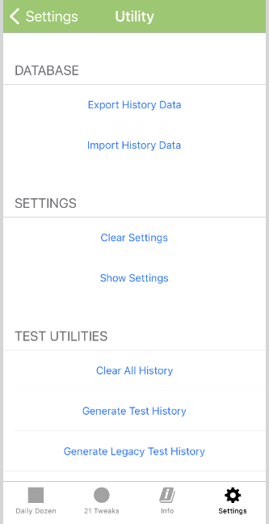

# Release Process

_This document contains items to be double checked before a production release._

## Test Configuration Notes

Verify that the following test configuration items have been set the appropriate production values.

_Test Name_

``` xml
<key>CFBundleDisplayName</key>
<string>DD Test</string>
```

_Production Name_

``` xml
<key>CFBundleDisplayName</key>
<string>DailyDozen</string>
```

**InfoMenuLayout.strings**

In the `DailyDozen/InfoMenu/InfoMenuAbout/Views/` directory, update the version number in the `Base.lproj/InfoMenuAboutLayout.storyboard` file and all the associated `*.lproj/InfoMenuAboutLayout.strings` localization files.

Script: [Scripts/Open_InfoMenuAboutLayout_BBEdit.sh.command](../Scripts/Open_InfoMenuAboutLayout_BBEdit.sh.command)

**Advanced Utilities**

The Daily Dozen > Settings > Advanced Utilities provides developer and tester functionality which would be unsafe for release to the general user base.
 
 Verify that Advanced Utilities is hidden for a production release. All instances of `advancedUtilitiesTableViewCell.isHidden` should be compiler switched based production vs. non-production builds with `#if DEBUG`, `#if targetEnvironment(simulator)` or something similar.

``` swift
#if DEBUG
advancedUtilitiesTableViewCell.isHidden = false
#endif
```


